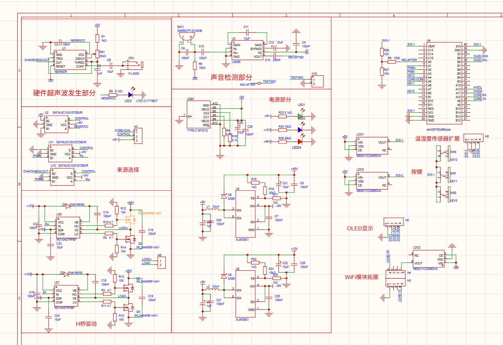
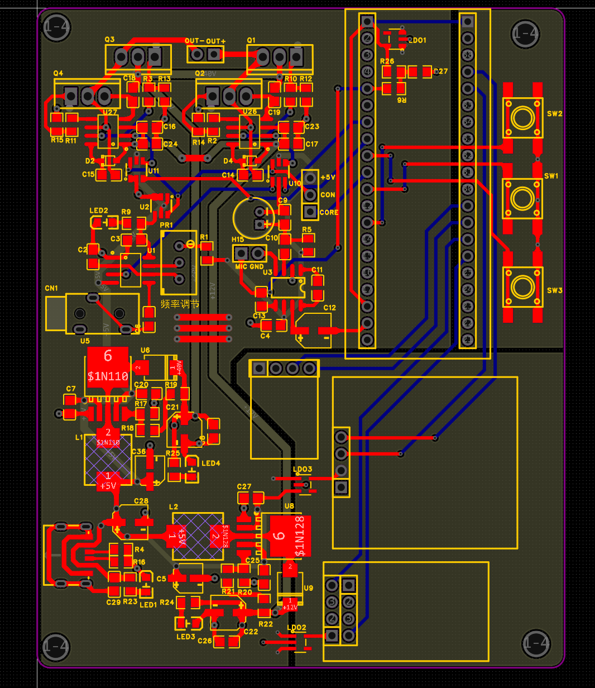

<div align="center">

# 录音屏蔽器

### 基于 STM32F103 的超声波录音屏蔽装置

`电子线路课程设计` · `24 年电赛 H 题方向`

这是一个课程设计，没有严格按照赛题要求做，加了自己的一些想法（**代码有点屎山，没有认真打磨** 👉👈）


[功能](#功能) · [系统架构](#系统架构) · [代码设计](#代码设计) · [硬件设计](#硬件设计) · [已知问题](#已知问题) · [待实现](#待实现) · [技术附录](#技术附录)

</div>

## 功能

### 硬件

**主路径（数字链路）**

- 麦克风实时拾取外部声音，交给单片机做数据分析
- 单片机输出 PWM，经 H 桥变成大功率驱动信号，推动超声波换能器阵列
- 超声波换能器阵列产生高频噪声
- OLED 与按键构成人机交互

**第二条路径（模拟支路）**

- 555 定时器产生高频方波
- 该路径可以经音频接口调制，让输出的高频屏蔽信号"放出对应的歌" 😊😊
- 该路径允许简单的阈值分析

**供电**

- 5V Type-C 输入，扩展出 20V、12V（左右）、5V 与 3V3 四条电压轨道

### 软件

- 实时分析外部输入的声音信号，并根据设置做数据处理
- 接受用户定义，允许修改各项设置
- 通过 PWM 输出高频噪声

## 系统架构


麦克风一路进 ADC，温湿度、OLED 挂在软件 I2C 上，按键走外部中断。主控按判定结果控制 TIM2 的两个通道输出互补 PWM，经 H 桥放大后驱动换能器阵列；555 支路与单片机相互独立，直接在硬件侧调制后并入换能器。

| 项 | 内容 |
| :--- | :--- |
| 主控 | STM32F103 @ 72 MHz，标准外设库 |
| 超声波输出 | TIM2 双通道 PWM，默认 40 kHz，可在 36 ~ 44 kHz 调节，占空比固定 50% |
| 声音输入 | PA0，ADC1 配合 DMA1 连续采样 |
| 人机交互 | 128×64 OLED + 3 个按键（外部中断触发） |
| 环境感知 | AHT20 温湿度传感器（软件 I2C） |
| 功率级 | H 桥驱动超声波换能器阵列 |
| 模拟支路 | 555 定时器高频方波 + 音频调制 |
| 联网 | ESP8266 AT 指令，代码已写但没跑通（校园网认证问题） |

## 代码设计

```text
本工程
├─assets                ->图片与示意图
├─DebugConfig
├─Hardware              ->与硬件的交互驱动
├─Library
├─Listings
├─Objects
├─showUI                ->软件面板代码设计
├─Start
├─System                ->系统时钟，延迟等
└─User
```

| 目录 | 内容 |
| :--- | :--- |
| `Hardware/` | 硬件驱动：AD 采样、按键、OLED、软件 I2C、串口、WiFi 模块、超声波控制 |
| `System/` | 系统服务：延时、RTC、定时器与 PWM 初始化 |
| `showUI/` | 面板与界面代码 |
| `User/` | 主函数与工程配置 |
| `Start/` | 启动文件与 CMSIS 内核文件 |
| `Library/` | STM32F10x 标准外设库 |
| `Objects/`、`Listings/`、`DebugConfig/` | 编译产物与调试配置 |

### 交互面板

*（第一次写交互面板，这个架构挺烂的，建议你可以重构一版）*

**总体思路是一个面板对应一个循环**


伪代码：

```c
while (根面板A 始终为1){
    交互根面板A
    if (进入子面板B)
        跳转子面板B
    if (进入子面板D)
        跳转进子面板D
}

while (子面板B 默认为1){
    交互子面板B
    if (返回根面板A)
        子面板B结束循环，自动退出
    if (进入子子面板C)
        跳转到C的while循环
    if (进入到子面板D)
        子面板B结束循环，自动退出，在根面板里面进入D循环
}
```

落到实现上，光标位置放在 `Key_state`，确认动作放在 `Key_con`：按键 1 / 按键 3 在中断里加减 `Key_state`，按键 2 把 `Key_con` 置 1，于是当前面板的 `while` 循环退出，再按 `Key_state` 的值统一执行跳转。

### 声音判定逻辑


## 硬件设计

### 供电结构


### PCB

<p align="center">
  
</p>
<p align="center"><sub>PCB 原理图</sub></p>

<p align="center">
  
</p>
<p align="center"><sub>PCB 版图</sub></p>

> 这个后续如果有空或许会扔到嘉立创开源社区（现在先放个图算完）

## 已知问题

- 开关部分（也就是切换那一块）没有做好信号和功率的分离，那一块有点问题
- 其他的忘了（这个距离太久远了，早忘了）

## 待实现

原本设计里还有下面这些功能，因为课程原因没有进一步打磨细化（👉👈）如果大家有意向可以扩展出来

#### 输出功率可调

- **没做的原因**　我忘了电赛还有这么个要求了（），当时看了眼大概方向就去做去了
- **可以怎么改**　可调功率的话，直接把供电部分升压模块里的调节电阻换成可控电阻就行，变阻器或数字电阻都可以

#### 硬件高频波输出部分的 H 桥以及更精细的控制

- **没做的原因**　一开始设计就不太明朗，原本留给硬件输出的接口只打算留"开"和"关"，没想到后面又加了 H 桥提高功率，也没很好地考虑单片机对这一路的控制
- **可以怎么改**　这个修改应该很简单（）

#### 联网功能

- **没做的原因**　校园网要认证，用流量开热点连接还一直有问题，把我整红温之后懒得干了（）
- **可以怎么改**　你加油！

## 技术附录

### 外设与引脚分配

| 模块 | 引脚 | 配置 | 代码位置 |
| :--- | :--- | :--- | :--- |
| 声音输入 | PA0 | ADC1 通道 0，DMA1 循环搬运 | `Hardware/AD.c` |
| 备用模拟输入 | PA1 | ADC1 通道 1 | `Hardware/AD.c` |
| PWM 主输出 | PA2 | TIM2_CH3，PWM1 正向，复用推挽 | `System/Timer.c` |
| PWM 互补输出 | PA3 | TIM2_CH4，PWM2 反向，由互补输出开关控制 | `System/Timer.c` |
| 按键 1 / 按键 3 | PB0 / PA4 | 下拉输入，上升沿触发，EXTI0 / EXTI4 | `Hardware/Key.c` |
| 按键 2 | PA6 | 下拉输入，上升沿触发，EXTI9_5 | `Hardware/Key.c` |
| OLED | PB8 / PB9 | 软件 I2C，SSD1306，从机地址 0x78 | `Hardware/OLED.c` |
| 温湿度 AHT20 | PA11 / PA12 | 软件 I2C（SDA / SCL） | `Hardware/MyI2C.c` |
| WiFi 模块 | PA9 / PA10 | USART1，115200，AT 指令 | `Hardware/Serial.c` · `Hardware/WIFI.c` |

### 定时器分配

| 定时器 | 用途 | 关键参数 |
| :--- | :--- | :--- |
| TIM2 | 超声波 PWM | 72 MHz 不分频，重装值 1799（默认 40 kHz），双通道 50% 占空比，频率可在 36 ~ 44 kHz 范围调节 |
| TIM3 | 温湿度采集节拍 | 预分频 960、重装 6000 → 12.5 Hz（约 80 ms）中断 |
| TIM1 | 定时基准 | 预分频 7200 → 0.1 ms 步进，默认 50 ms 中断周期 |

### 判定参数

| 参数 | 取值范围 | 说明 |
| :--- | :--- | :--- |
| 阈值等级 | 1 ~ 10 | `final_thresh = 2000 + (等级 − 1) × 120`，门槛 2000 ~ 3080 |
| 灵敏度 | 1 ~ 10 | 环形滑窗长度 `250 − (灵敏度 − 1) × 25`，即 250 ~ 25 点 |
| 忽略区间 | 1763 ~ 2400 | 采样值落在此区间内时不计为有效 |
| 有效占比门槛 | > 20 % | 滑窗内有效点占比超过 20 % 才输出 |

